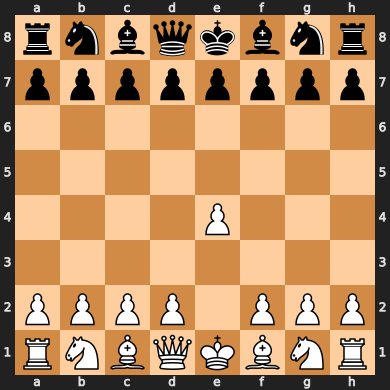

# Chess Engine


A deep learning-powered chess engine that uses a neural network model to predict the best moves in chess games. This project leverages PyTorch for model training and inference and can evaluate board positions and suggest legal moves. Currently the model is trained on 10157 games. If you have more memory then you can add more bigger data.\
Unfortunately even with abundant SWAP memory my laptop kept crashing with bigger data; so the engine currently is not very powerful.\
Adding a blunder detection algorithm can help the engine perform better.

## Features

- **Deep Learning Model**: A CNN model trained to predict moves based on board positions.
- **Board Evaluation**: Converts board states into tensors for model input.
- **Legal Move Selection**: Ensures only legal moves are recommended.
- **GPU Support**: Utilizes CUDA if available for faster computations.

## Setup and Installation

### Prerequisites

- Python 3.7+
- Required libraries: `torch`,`tqdm`, `numpy`, `pickle`, `chess` (python-chess)
- A CUDA-capable GPU (optional, for faster performance)

### Installation

1. Clone the repository:

    ```bash
    git clone https://github.com/RustedSwords/chessengine.git
    cd chessengine
    ```

2. Install required packages:

    ```bash
    pip install -r requirements.txt
    ```

3. Ensure that `CHESSDATA.pth` (the trained model) and `move_to_int` (move mappings) files are placed in the `/models` directory.

## Usage

### Predicting Moves

1. Initialize the chess board and model:

    ```python
    import chess
    from model import ChessModel
    from utils import predict_move, board_to_matrix, get_input

    # Create a chess board
    board = chess.Board()

    # Load the model and mappings
    model = ChessModel(num_classes=len(move_to_int))
    model.load_state_dict(torch.load("/path/to/models/CHESSDATA.pth"))
    model.eval()

    # Make a prediction
    best_move = predict_move(board)
    board.push_uci(best_move)
    print("Predicted Move:", best_move)
    ```

### Training (Optional)

If you want to train the model on a new dataset, you’ll need a PGN dataset and modify the `train.ipynb`. \
Simply add your PGN datasets to `data/pgn`.\
I used the data from [here](https://theweekinchess.com/twic).